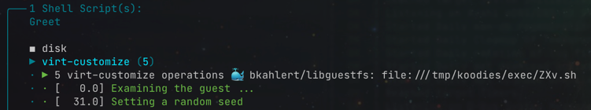
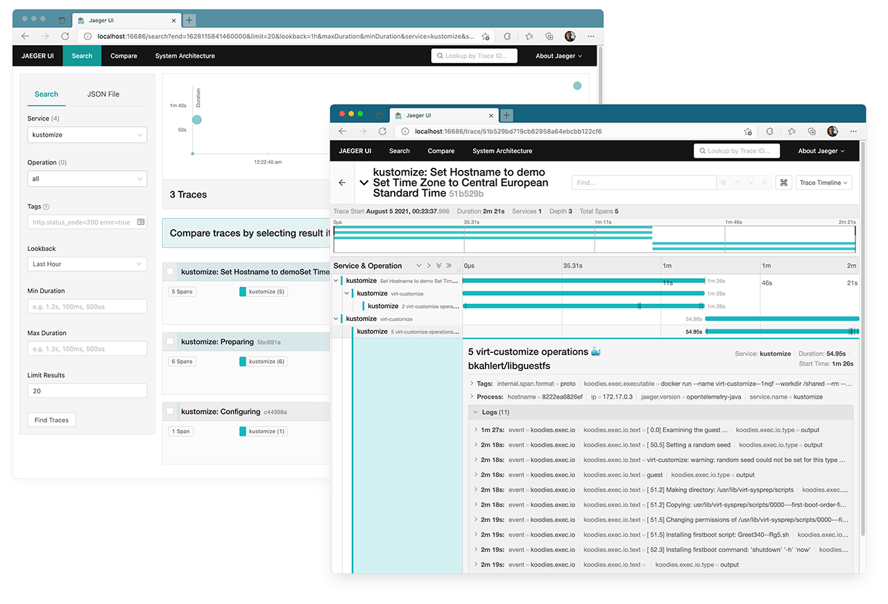

# Kustomize

**Kotlin-based customizer for IoT images like [Raspberry Pi OS](https://www.raspberrypi.org/software/operating-systems)**  
Kustomize applies a [HOCON](https://github.com/lightbend/config/blob/master/HOCON.md) based customization file to a [Raspberry Pi](https://www.raspberrypi.org/)
compatible image.  
All that needs to be done is flash the image to a memory card and boot the fully-customized image on the target device.


**In short: sample.conf + kustomize = sample.img**

```hocon
os = Raspberry Pi OS Lite
timezone = Europe/Berlin

hostname {
  name: "sample"
  random-suffix: true
}

setup = [
  {
    name: setup things
    scripts: [
      {
        name: Greet
        content: "echo '👏 🤓 👋'"
      },
    ]
  },
]
```

`+`

```shell
kustomize --config-file sample.conf
# OR
docker run --rm -it \
           -v /var/run/docker.sock:/var/run/docker.sock \
           -v /tmp/kommons:/tmp/kommons \
           -v "$(pwd)":"$(pwd)" \
           -w "$(pwd)" \
           bkahlert/kustomize \
           --config-file sample.conf 
```

`=`

```log
░░░░░░░ KUSTOMIZE

▶ Configuring
· Configuration: file:///home/john/sample/sample.conf (256 B)
· Name: .test
· OS: Raspberry Pi OS Lite
· Env: file:///home/john/sample/.env
· Cache: file:///home/sample/john
✔︎
▶ Preparing
· Listing images ✔︎
· Pulling lukechilds/dockerpi:vm image ✔︎
· ▶ Deleting old working directories ✔︎
· ▶ Retrieving image
· · ▶ Downloading https://downloads.raspberrypi.org/raspios_lite_armhf_latest ✔︎
· · ▶ Moving download to file:///home/john/sample/download/raspios_lite_armhf_latest ✔︎
· · ▶ Unarchiving file:///home/john/sample … und image 2021-05-07-raspios-buster-armhf-lite.img ✔︎
· · ▶ Moving download to file:///home/john/sample/raw/2021-05-07-raspios-buster-armhf-lite.img ✔︎
· ✔︎
✔︎
▶ Applying 2 patches to Raspberry Pi OS Lite ／ 2021-05-07-raspios-buster-armhf-lite.img
· ╭──╴Set Hostname to sample
· │   Set Time Zone to Central European Standard Time
· │   Change Username pi to john.doe
· │
· │   ◼ disk
· │   ▶ virt-customize (17)
· │   · ▶ 17 virt-customize operations 🐳 bkahlert/libguestfs: file:///tmp/kommons/exec/WPG.sh
· │   · · [   0.0] Examining the guest ...
· │   · · [  31.8] Setting a random seed
· │   · · [  32.2] Setting the machine ID in /etc/machine-id
· │   · · [  32.2] Setting the hostname: sample--aTy0
· │   · · [  43.5] Setting the timezone: Europe/Berlin
· │   · · [  43.6] Appending line to /etc/sudoers.d/privacy
· │   · · [  43.7] Appending line to /etc/sudoers
· │   · · [  43.7] Making directory: /usr/lib/virt-sysprep/scripts
· │   · · [  43.7] Copying: usr/lib/virt-sysp … st-boot-order-fix to /usr/lib/virt-sysprep/scripts
· │   · · [  43.8] Changing permissions of /u … ysprep/scripts/0000---first-boot-order-fix to 0755
· │   · · [  43.8] Making directory: /etc/systemd/system
· │   · · [  43.8] Copying: etc/systemd/system/firstboot-wait.service to /etc/systemd/system
· │   · · [  43.9] Making directory: /etc/systemd/system/multi-user.target.wants
· │   · · [  43.9] Linking: /etc/systemd/syst … vice -> /etc/systemd/system/firstboot-wait.service
· │   · · [  44.0] Making directory: /etc/systemd/scripts
· │   · · [  44.0] Copying: etc/systemd/scripts/firstboot-wait.sh to /etc/systemd/scripts
· │   · · [  44.1] Changing permissions of /etc/systemd/scripts/firstboot-wait.sh to 0755
· │   · · [  44.1] Installing firstboot command: usermod -l john.doe pi
· │   · · [  44.6] Installing firstboot command: groupmod -n john.doe pi
· │   · · [  45.0] Installing firstboot command: usermod -d /home/john.doe -m john.doe
· │   · · [  45.9] Finishing off
· │   · ✔︎
· │   ✔︎
· │   ◼ guestfish
· │   ◼ File Operations
· │   ▶ boot
· │   · ▶ Running Raspberry Pi OS Lite ／ 202 … -raspios-buster-armhf-lite.img with
· │   · · image: /sdcard/filesystem.img
· ┊   · ·
· │   · · firstboot.sh[385]: === Running /usr … -john-doe-pi ===                    ◀◀ login
· │   · · firstboot.sh[385]: === Running /usr … n-john-doe-pi ===                   ◀◀ login
· │   · · firstboot.sh[385]: === Running /usr … --home-john-doe--m-john-doe ===     ◀◀ login
· │   · · firstboot-wait.sh[387]: CHECKING SCRIPTS ⮕ SCRIPTS-DONE … COMPLETED      ◀◀ login
· │   · · [  OK  ] Started libguestfs firstboot service completion.                 ◀◀ login
· │   · · [  OK  ] Started Serial Getty on ttyAMA0.                                 ◀◀ login
· │   · · [  OK  ] Reached target Login Prompts.                                    ◀◀ login
· │   · ·                                                                           ◀◀ login
· │   · ·                                                                           ◀◀ login
· │   · · Raspbian GNU/Linux 10 sample--aTy0 ttyAMA0                                ◀◀ login
· │   · ·                                                                           ◀◀ login
· │   · · sample--aTy0 login:                                                       ◀◀ login
· │   · ·                                                                           
· │   · ·         ̣ ˱ ❨ ( Entering "john.doe" )                                      
· │   · · {*≧∀≦}                                                                    
· │   · ·                                                                           
· │   · · sample--aTy0 login: john.doe                                              ◀◀ login
· │   · ·                                                                           ◀◀ login
· │   · · Password:                                                                 ◀◀ login
· │   · ·                                                                           
· │   · ·         ̣ ˱ ❨ ( Entering "raspberry" )                                     
· │   · · ( ´ｰ`)                                                                    
· │   · ·                                                                           
· │   · · Password:                                                                 ◀◀ login
· │   · · Linux sample--aTy0 4.19.50+ #1 Tue Nov 26 01:49:16 CET 2019 armv6l        ◀◀ login
· │   · ·                                                                           ◀◀ login
· │   · · The programs included with the Debian GNU/Linux system are free software; ◀◀ login
· │   · · the exact distribution terms for each program are described in the        ◀◀ login
· │   · · individual files in /usr/share/doc/*/copyright.                           ◀◀ login
· │   · ·                                                                           ◀◀ login
· │   · · Debian GNU/Linux comes with ABSOLUTELY NO WARRANTY, to the extent         ◀◀ login
· │   · · permitted by applicable law.                                              ◀◀ login
· │   · · [  OK  ] Created slice User Slice of UID 1000.                            ◀◀ login
· │   · ·          Starting User Runtime Directory /run/user/1000...                ◀◀ login
· │   · · [  OK  ] Started User Runtime Directory /run/user/1000.                   ◀◀ login
· │   · ·          Starting User Manager for UID 1000...                            ◀◀ login
· │   · · [  OK  ] Started User Manager for UID 1000.                               ◀◀ login
· │   · · [  OK  ] Started Session c1 of user john.doe.                             ◀◀ login
· │   · · john.doe@sample--aTy0:~$                                                  ◀◀ login
· │   · ·                                                                           
· │   · ·               ̣ ˱ ❨ ( Logged in successfully )                             
· │   · · （；￣︶￣）                                                                
· │   · ·                                                                           
· │   · ·                                                                           
· │   · ·            ̣ ˱ ❨ ( Entering "ls /home/pi" )                                
· │   · · （´∀`）ｂ                                                                    
· │   · ·                                                                           
· │   · · john.doe@sample--aTy0:~$ ls /home/pi                                      ◀◀ finish
· │   · · ls: cannot access '/home/pi': No such file or directory                   ◀◀ finish
· │   · · john.doe@sample--aTy0:~$                                                  ◀◀ finish
· │   · ·                                                                           
· │   · ·      ̣ ˱ ❨ ( Entering "id pi" )                                            
· │   · · ▼ω▼                                                                       
· │   · ·                                                                           
· │   · · john.doe@sample--aTy0:~$ id pi                                            ◀◀ finish
· │   · · id: ‘pi’: no such user                                                    ◀◀ finish
· │   · · john.doe@sample--aTy0:~$                                                  ◀◀ finish
· │   · ·                                                                           
· │   · ·         ̣ ˱ ❨ ( Entering "id john.doe" )                                   
· │   · · (^_^)v                                                                    
· │   · ·                                                                           
· │   · · john.doe@sample--aTy0:~$ id john.doe                                      ◀◀ finish
· │   · · uid=1000(john.doe) gid=1000(john.doe) groups … (cdrom),27(sudo),29(audio) ◀◀ finish
· │   · · john.doe@sample--aTy0:~$                                                  ◀◀ finish
· │   · · Watchdog started. Timing out in 5.00s.                                    
· │   · · Watchdog stopped.                                                         
· │   · ·                                                                           
· │   · ·         ̣ ˱ ❨ ( Entering "'sudo' 'shutdown' '-h' 'now'" )                  
· │   · · (^^)ｂ                                                                    
· │   · ·                                                                           
· │   · · john.doe@sample--aTy0:~$ 'sudo' 'shutdown' '-h' 'now'                     ◀◀ shutdown
· │   · · [  OK  ] Stopped target Timers.                                           ◀◀ shutdown
· │   · · [  OK  ] Stopped Daily Cleanup of Temporary Directories.                  ◀◀ shutdown
· ┊   · ·
· │   · · [  OK  ] Reached target Power-Off.                                        ◀◀ shutdown
· │   · · reboot: System halted                                                     ◼
· │   · ✔︎
· │   ✔︎
· │
· ╰──╴✔︎
· ╭──╴Set Password of john.doe
· │
· │   ◼ disk
· │   ▶ virt-customize (1)
· │   · ▶ 1 virt-customize operation 🐳 bkahlert/libguestfs: file:///tmp/kommons/exec/6z1.sh
· │   · · [   0.0] Examining the guest ...
· │   · · [  32.1] Setting a random seed
· │   · · [  32.6] Setting passwords
· │   · · [  43.9] Finishing off
· │   · ✔︎
· │   ✔︎
· │   ◼ guestfish
· │   ◼ File Operations
· │   ◼ boot
· │
· ╰──╴✔︎
✔︎

(／￣‿￣)／~~☆’․･․･﹕☆ sample.img @ file:///home/john/sample/2021-07-19T23-56-57--OJPy/
```

The just customized `sample.img` can now be flashed to a memory card and booted on your Raspberry.

### Architecture and Debugging

Kustomize is based on the Kotlin library [Kommons](https://github.com/bkahlert/kommons), applies offline modifications using
a [dockerized libguestfs](https://hub.docker.com/repository/docker/bkahlert/libguestfs) (i.e. [virt-customize](https://libguestfs.org/virt-customize.1.html)
and [guestfish](https://libguestfs.org/guestfish.1.html)), and runs scripts on the guest using the marvelous [dockerpi](https://github.com/lukechilds/dockerpi).

Customization options are modelled as patches that are translated to shell scripts. Throughout the customization process all scripts are logged as file
locations that can be opened right in your terminal.



If your terminal supports it, <kbd>Ctrl ⌃</kbd> respectively <kbd>Cmd ⌘</kbd> click on `/tmp/kommons/exec/ZXv.sh` and check the script's content:

```shell
#!/bin/sh
'docker' 'run' \
'--name' 'virt-customize--wppn' \
'--workdir' '/shared' \
'--rm' '--interactive' \
'--mount' 'type=bind,source=/home/john/sample/sample/2021-08-04T01-07-52--V5wH/shared,target=/shared' \
'--mount' 'type=bind,source=/home/john/sample/sample/2021-08-04T01-07-52--V5wH/2021-05-07-raspios-buster-armhf-lite.img,target=/images/disk.img' \
'bkahlert/libguestfs@sha256:de20843ae800c12a8b498c10ec27e2136b55dee4d62d927dff6b3ae360676d00' \
'virt-customize' \
'--add' '/images/disk.img' \
'--colors' \
'--mkdir' '/usr/lib/virt-sysprep/scripts' \
'--copy-in' 'usr/lib/virt-sysprep/scripts/0000---first-boot-order-fix:/usr/lib/virt-sysprep/scripts' \
'--chmod' '0755:/usr/lib/virt-sysprep/scripts/0000---first-boot-order-fix' \
'--firstboot' 'Greet340--vsv.sh' \
'--firstboot-command' ''"'"'shutdown'"'"' '"'"'-h'"'"' '"'"'now'"'"'
'
```

#### Tracing

For more detailed information on the customization, the whole process can be traced to a locally started Jaeger instance at http://localhost:16686
using `--jaeger-hostname`:

```shell
kustomize --config-file sample.conf --jaeger-hostname localhost
# OR
docker run --rm -it \
           -v /var/run/docker.sock:/var/run/docker.sock \
           -v /tmp/kommons:/tmp/kommons \
           -v "$(pwd)":"$(pwd)" \
           -w "$(pwd)" \
           bkahlert/kustomize \
           --config-file sample.conf \
           --jaeger-hostname host.docker.internal
```

There is no need to start a Jaeger yourself as it's automatically launched for you.



## Configuration Options

See [sample-full.conf](sample-full.conf) for all existing configuration options.

## Build

### Binaries

```shell
./gradlew build -x test
```

### Docker

```shell
docker build -t bkahlert/kustomize:latest .
```

## TODO

- [ ] Bluetooth PAN support
- [ ] Webcam support; `apt-get install -y git streamer`
- [ ] Evaluate Ansible integration
    - https://github.com/garthvh/ansible-raspi-playbooks/tree/master/tasks
    - https://github.com/garthvh/ansible-raspi-playbooks/blob/master/tasks/tzdata.yml
    - https://github.com/garthvh/ansible-raspi-playbooks/blob/master/tasks/internationalization.yml
    - https://github.com/garthvh/ansible-raspi-playbooks/blob/master/playbooks/new-default.yml
